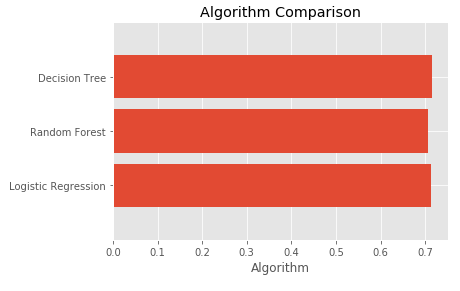
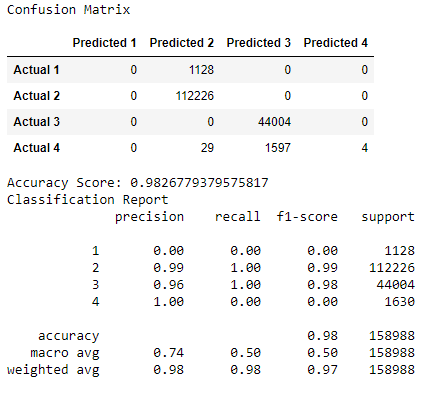

# final
Final group project
## Team Name
accidentsHappen

## Google Slides
[Slides Link](https://drive.google.com/file/d/1ud5LxVQhqDQVythqhW2E_3Y9M8qgcm1X/view)

## Team Members
Joshuapaul Rivera, Robert Lau, Simranjot Singh, and Kim Ngo

## DatasetA 
Kaggle dataset of [car accidents](https://www.kaggle.com/sobhanmoosavi/us-accidents) in the contingent US from 2016-2020*

Reason Our team became interested in this project topic because one of our members was involved in a severe caraccident. Due to bad road conditions, their car skidded across the freeway, onto the center divider. As a result, our member was hospitalized.Their story inspired us to use a dataset to analyze and predict the chances of getting in an accident based on specific criteria and data.We see great potential in utilizing this dataset to provide interesting insights and research.

## Programs 
ETL: Python, Jupyter Notebook, PostgreSQLVisualizations and Dashboard: JavaScript, CSS, HTMLForecasting and Analysis: Supervised Machine Learning

## Objectives 
By entering certain criteria such as zip codes, seasonal trends, severity, and traffic attributes, one can better forecast the chances of getting into a car accident. It is a simple and easy tool that any driver can use. 

## Machine Learning

Before starting on machine learning, we performed ETL to clean and transform the data. We transformed the data to provide additional analysis such as adding part of the week and time of day columns. We cleaned the datetime column so that year and month will have it's own column.

In processing the data, we used "Severity" as our target value and the rest of the columns such as latitude, longitude, zipcpde, and etc. will be our features. In order to use "Severity" as our target, we will use the code below:

```
# Define target vector
X = filtered_cleaned_df.copy()
X = filtered_cleaned_df.drop('Severity', axis=1)
y = filtered_cleaned_df['Severity']
```

All of our data consists of accidents with different severity levels. Therefore, we chose severity as our target because we can perform a prediction on the severity level of a car accident. 

After choosing our target variable, we had to use pd.get_dummies to convert our columns from object to float or integer. The values will be separated into new columns with a value of 0 and 1. We will use get_dummies for these columns: County, Month, Time, and Part_of_Week.

To split the data, the y value will be our target and our x value will be our features. We will use the code below and use StandardScaler to scale the data:

```
# Splitting into Train and Test sets
X_train, X_test, y_train, y_test = train_test_split(X, y, random_state=78, train_size=0.80)

# Creating a StandardScaler instance.
scaler = StandardScaler()

# Fitting the Standard Scaler with the training data.
X_scaler = scaler.fit(X_train)

# Scaling the data.
X_train_scaled = X_scaler.transform(X_train)
X_test_scaled = X_scaler.transform(X_test)
```
## Important Features Bar Graph


We've tested three models: random forest classifier, logistic regression classifier, and K-Nearest Neighbors. KNN prsesented improved results at 72% testing accuracy compared to random forest and logistic regression at 68% testing accuracy for each model. Although KNN showed increased testing accuracy, it's less efficient. The KNN model was running for 8 hours compared to 1 hour of random forest and 1 hour of logistic regression. Additionally, logistic regression's training accuracy is at 31%. KNN is more robust, but it lacks in efficiency. Overall, the best machine learning model is random forest.

In the future of machine learning, we can reduce the number of features be removing or transforming other attributes such as wind direction, wind speed, and weather conditions. Wind speed and direction might not play a huge role in accident severity. Weather conditions can be transformed and simplified. For example, if we have light rain and heavy rain, we can transform and combine into one rain category. Similar situation for cloudy and partly cloudy. We can combine into one cloudy category. By reducing or removing some features, we can improve our accuracy percentage.


## Machine Learning Update

In the last week of deliverables, we've updated our data and machine learning algorithm. We removed KNN model since it is not time efficient, but we added Decision Tree model to have more models to compare. We narrowed our data to just California instead of the United States. Our accuracy score decreased slightly to 71% for all machine learning models. We chose Decision Tree because the accuracy score is slightly higher than the rest of the models. 

## Bar Graph of Machine Learning Model Comparison 


We've also ran a confusion matrix to find any true positive, true negatives, false positives, and false negatives. 

## Table of Confusion Matrix


Our analysis showed 0% precision for level 1 severity, 99% precision for level 2 severity, 96% precision for level 3 severity, and 100% precision for level 4 severity. The overall accuracy score for the confusion matrix is 98%. There are false positives in predicting severity level 2 and level 3. For severity level 2, it predicted values that are actually in severity level 1 and level 4. For severity level 3, it predicted values that are actually in severity level 4. Overall, the high accuracy score will allow users to confidently and accurately predict the level of severity if they get into an accident.
