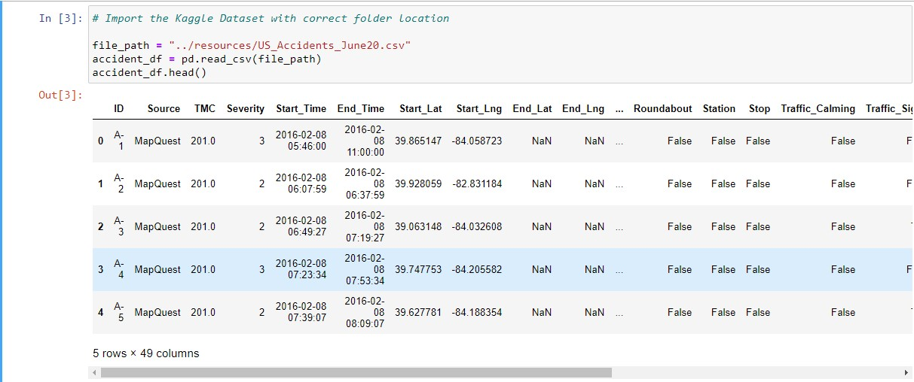
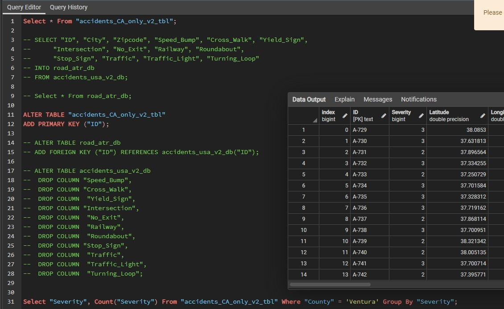
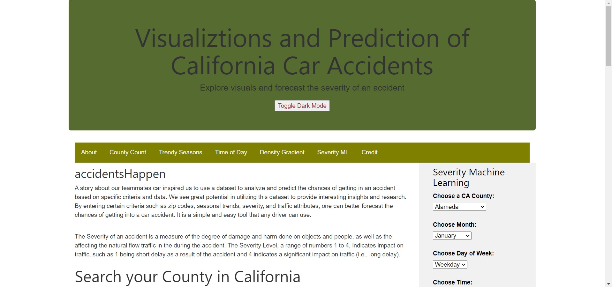
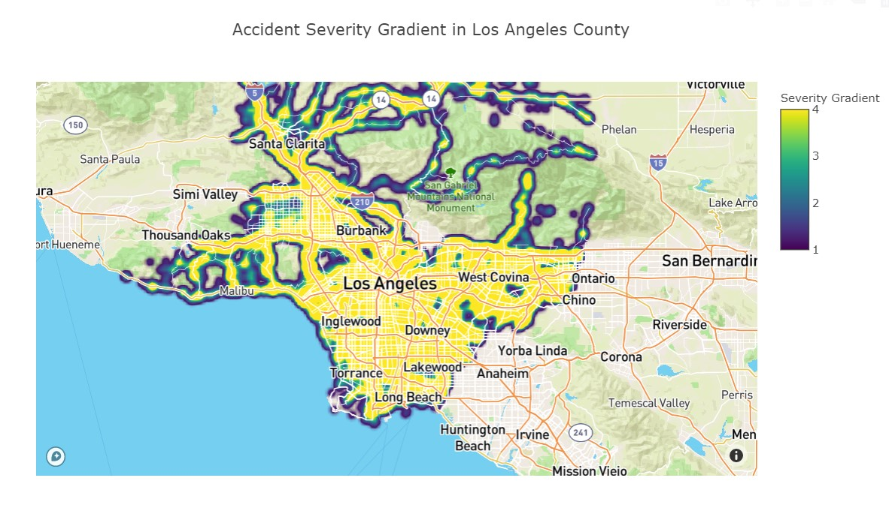
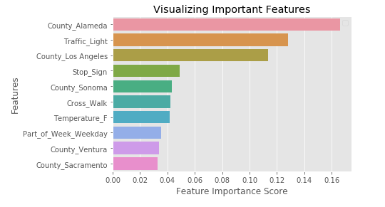
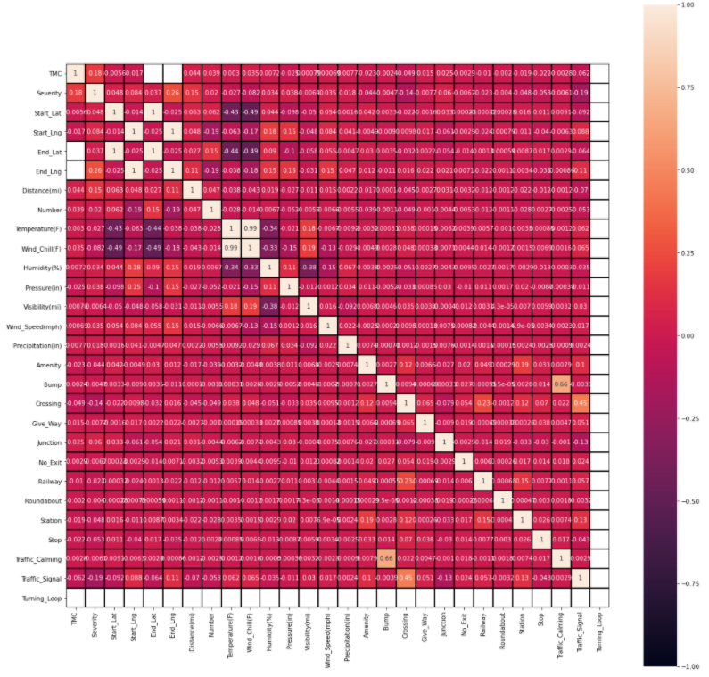

# accidentsHappen
A Group Project for UC Berkeley Extension Data Analysis and Visualization Bootcamp (May-Oct 2020)

[Google Slides Presentation](https://drive.google.com/file/d/1ud5LxVQhqDQVythqhW2E_3Y9M8qgcm1X/view)

## Team Members
Joshuapaul Rivera, Robert Lau, Simranjot Singh, and Kim Ngo


---

## Objectives 

Driving on the road is simple, rather long and tedious. However, we cannot help but look at a car accident that happens to be on our route. It is known as rubbernecking, a human trait also known as morbid curiosity, that steals our attention at the scene of tragedy and disaster. An interesting aspect to attribute to our natural trait is adding ***severity*** to hopefully combine the act of looking at tragedy with the rate of traffic. 

### Addressing Severity

We will define ***Severity*** of an accident -- how severe an accident is -- as a measure of damage and harm done on objects and people, as well as the effect on traffic flow during certain events. The Severity Level is a range of numbers from 1 to 4, which indicates impact on traffic in our dataset:

1. Indicates a short traffic delay and/or a minor accident
    - Traffic comes to a slow (butterfly effect)
    - Minor bump or accident
2. Indicates traffic delay and/or visible damage 
    - Traffic comes to a stop for a short period time, road work ahead
    - Accident with visible dents, possible damage to the car, some harm done to persons involved
3. Indicates complete traffic standstill and/or major accident
    - Rush Hour traffic during peak commuting times
    - Possible irreversible damage to the car
    - Significant effect on motor functions and balance right after the accident, possible concussion
4. Indicates major road/lane block and/or multiple accidents involved
    - Unmoving traffic, requires redirection and assistance of enforcement
    - Multiple accidents, car-piling, and possibility of incapacitation and/or death 


By entering certain criteria such as county names, seasonal trends, and road attributes, one can visually ascertain the count of accidents in different timeframes and locations as well as the severity of an accident if one were to select certain attributes. A simple and elegant dashboard created with datasets to fulfill the need for rubbernecking on the internet. 

---
## Programs 
- ETL: Python, Jupyter Notebook, PostgreSQL
- Visualizations and Dashboard: JavaScript, CSS, HTML, Sqlalchemy, AJAX
- Forecasting and Analysis: Supervised Machine Learning, Decision Tree, Random Forest
- Modules and Libraries such as Pandas, Numpy, Psycopg2, Plotly, D3.js, Mapbox Bootstrap, Seaborn, Pickle, Sklearn Metrics, and Tensorflow

## Dataset and Database
Kaggle dataset of [car accidents](https://www.kaggle.com/sobhanmoosavi/us-accidents) in the contingent US from 2016-2020* 

The reason our team became interested in this project topic because one of our members was involved in a severe car accident. Due to bad road conditions, their car skidded across the freeway, onto the center divider and as a result, our member was hospitalized. Their story inspired us to use a dataset to analyze and predict the chances of getting in an accident based on specific criteria and data. We see great potential in utilizing this dataset to provide interesting insights and research.

While the original dataset had +3 million rows, the cleaned dataset, post ETL, still had 1.3 million rows, causing concern for ML models and potential problems in reading CSV since we are hosting this project locally.


We started the ETL process by dropping many columns such as Airport_Code, End_Lat, Street, Country, Timezone, Weather_Timestamp, Astronomical_Twilight since they added no values to our insights or they did not add interest in our analysis. We added new columns combined from dropped ones such as Days of the Week and Part of the Day because we think they can add more value in our dataset research.

After careful consideration, we dropped all states except California, and kept our focus on the "County" variable as our main search query. It was in best interest to reduce the load to make our ML and Visualizations more efficient and balanced.


Lastly, we used Sqlalchemy to import our dataset to PostgreSQL. Since we had one large dataset complied, we felt it was not necessary to create additional tables and split/join tables since that may increase our workload. Furthermore, we had to keep track of SQL queries since they assisted our dashboard workload. We did not use cloud databases since we were hesitant to consider the pay-as-go models for most databases. Plus, uploading the raw dataset could have been a hindrance. 



---

## Dashboard and Visualizations

We created a HTML dashboard because it has potential for infinite customization and storytelling. Here's our final product:  


We began by adding custom layouts and styles with Javascript and CSS. We decided early on that, as part of rubric, we wanted to include visual graphs with interactivity as well as a Machine Learning filter selection that predicts Severity.

Initially, our complete US accidents csv dataset was not being read by D3.csv and Plotly.d3.csv since javascript is client side, it has to load all scripts and files first in order to run anything. Even if the dataset managed to load, configuring graphs would also take time to render. We tried different methods such as Mpld3 input, Papaparse, and subsetting our dataset in smaller, more sizable tables. These methods lead to dead ends such as incomprehensible HTML code and complicated code to join many small tables. Therefore, in order to make a our dashboard viable, we created a js -> <- flask -> <- sql loop to publish live results, with the help of AJAX jquery and Sqlalchemy. Sqlalchemy

At the whim of the user, such as selecting a California County, the input's value from HTML is saved as a javascript variable by getElement. We confine the variable with various restrictions and coercion to pass, then it is passed onto a url string to be read by Flask request with search query and app routes. At this point, Sqlalchemy readies it engines and is ready to pass on query strings with Flask request. To put it simply, we created a readymade SQL queries as text which get forwarded to query a smaller, subset table, which is returned as a JSON object array. Next, the JSON is loaded from the server using a HTTP GET request. If the JSON is returned, the success function is launched, which elegantly gets iterated to match tracing and layout for a plotly graph. Lastly, the graph is plotted with the correct ID tag.

From this loop, we added queries for severity count, monthly accident trends, time of day accidents, and, most importantly, an interactive density gradient of mapped severity values, and all of this is rendered by a user selecting a county from dashboard dropdown. 



---

## Machine Learning

Before starting on machine learning, we performed ETL to clean and transform the data. We transformed the data to provide additional analysis such as adding part of the week and time of day columns. We cleaned the datetime column so that year and month will have it's own column.

In processing the data, we used "Severity" as our target value and the rest of the columns such as latitude, longitude, zipcpde, etc. will be our features. To use "Severity" as our target, we will use the code below:

```
# Define target vector
X = filtered_cleaned_df.copy()
X = filtered_cleaned_df.drop('Severity', axis=1)
y = filtered_cleaned_df['Severity']
```

All of our data consists of accidents with different severity levels. Therefore, we chose severity as our target because we can perform a prediction on the severity level of a car accident. 

After choosing our target variable, we had to use pd.get_dummies to convert our columns from object to float or integer. The values will be separated into new columns with a value of 0 and 1. We will use get_dummies for these columns: County, Month, Time, and Part_of_Week.

To split the data, the y value will be our target and our x value will be our features. We will use the code below and use StandardScaler to scale the data:

```
# Splitting into Train and Test sets
X_train, X_test, y_train, y_test = train_test_split(X, y, random_state=78, train_size=0.80)

# Creating a StandardScaler instance.
scaler = StandardScaler()

# Fitting the Standard Scaler with the training data.
X_scaler = scaler.fit(X_train)

# Scaling the data.
X_train_scaled = X_scaler.transform(X_train)
X_test_scaled = X_scaler.transform(X_test)
```
## Important Features Bar Graph


We have tested three models: random forest classifier, logistic regression classifier, and K-Nearest Neighbors. KNN presented improved results at 72% testing accuracy compared to random forest and logistic regression at 68% testing accuracy for each model. Although KNN showed increased testing accuracy, it's less efficient. The KNN model was running for 8 hours compared to 1 hour of random forest and 1 hour of logistic regression. Additionally, logistic regression's training accuracy is at 31%. KNN is more robust, but it lacks in efficiency. Overall, the best machine learning model is random forest.

In the future of machine learning, we can reduce the number of features be removing or transforming other attributes such as wind direction, wind speed, and weather conditions. Wind speed and direction might not play a huge role in accident severity. Weather conditions can be transformed and simplified. For example, if we have light rain and heavy rain, we can transform and combine into one rain category. Similar situation for cloudy and partly cloudy. We can combine into one cloudy category. By reducing or removing some features, we can improve our accuracy percentage.

## Heatmap Correlation of Features


## Machine Learning Update

In the last week of deliverables, we have updated our data and machine learning algorithm. We removed KNN model since it is not time efficient, but we added Decision Tree model to have more models to compare. We narrowed our data to just California instead of the United States. Our accuracy score decreased slightly to 71% for all machine learning models. We chose Decision Tree because the accuracy score is slightly higher than the rest of the models. 

## Bar Graph of Machine Learning Model Comparison 


We have also ran a confusion matrix to find any true positive, true negatives, false positives, and false negatives. 

## Table of Confusion Matrix


Our analysis showed 0% precision for level 1 severity, 99% precision for level 2 severity, 96% precision for level 3 severity, and 100% precision for level 4 severity. The overall accuracy score for the confusion matrix is 98%. There are false positives in predicting severity level 2 and level 3. For severity level 2, it predicted values that are in severity level 1 and level 4. For severity level 3, it predicted values that are in severity level 4. Overall, the high accuracy score will allow users to predict the level of severity confidently and accurately if they get into an accident.

